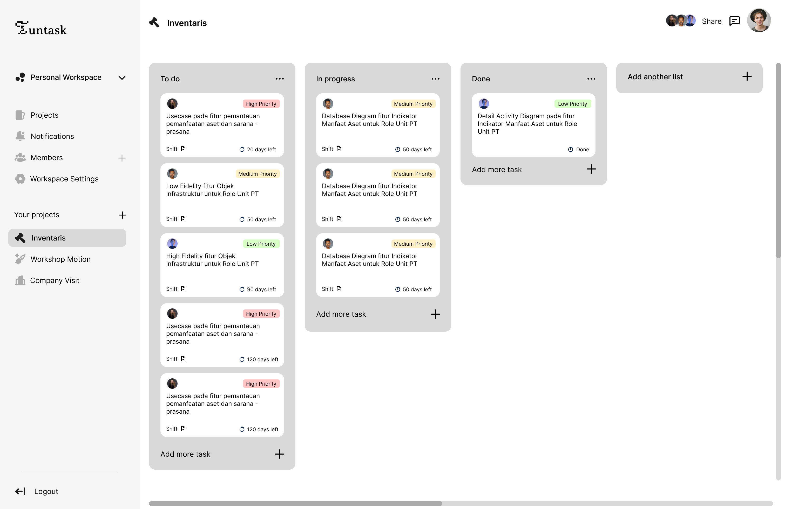
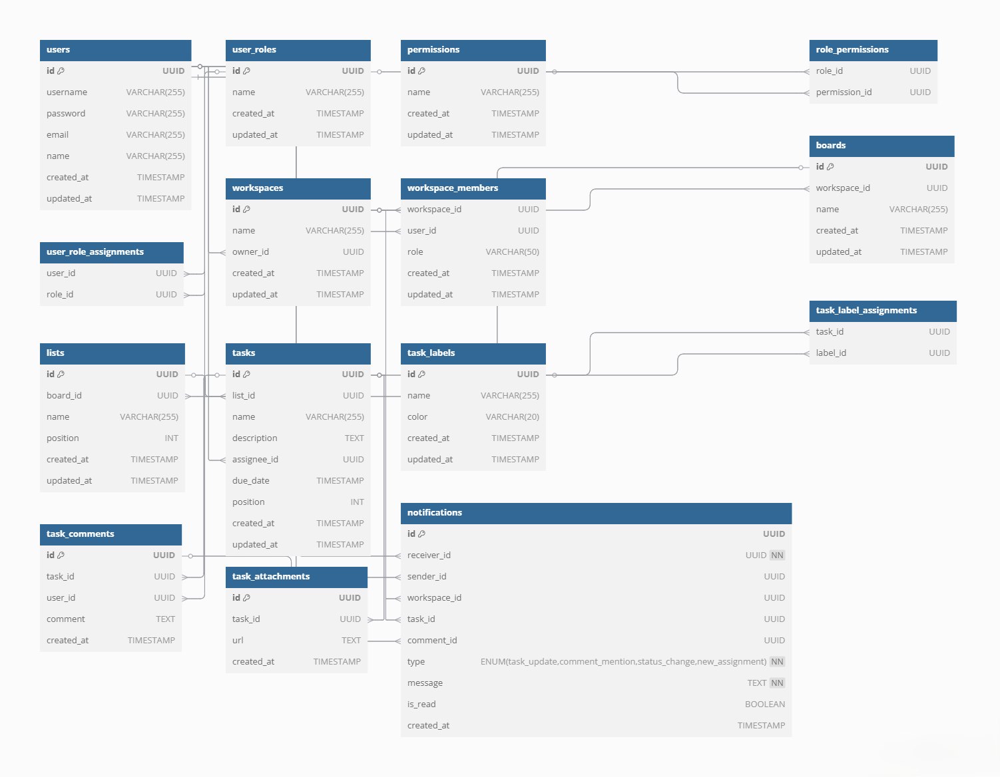

<p align="center">
  
</p>

<h1 align="center">Tuntask Management System</h1>

<p align="center">
  Platform manajemen tugas yang dirancang khusus untuk meningkatkan produktivitas dan kolaborasi tim dalam lingkup organisasi kampus atau himpunan.
</p>

<p align="center">
  
</p>

---

## 📖 Daftar Isi

- [Tentang Proyek](#-tentang-proyek)
- [Mulai Cepat (Getting Started)](#-mulai-cepat-getting-started)
  - [Prasyarat](#prasyarat)
  - [Opsi 1: Menjalankan dengan Docker Compose](#opsi-1-menjalankan-dengan-docker-compose)
  - [Opsi 2: Menjalankan dengan Kubernetes](#opsi-2-menjalankan-dengan-kubernetes)
- [Akses Aplikasi](#-akses-aplikasi)
- [Panduan Kontribusi](#-panduan-kontribusi)
  - [Alur Kerja Git & Konvensi](#alur-kerja-git--konvensi)
- [Struktur Proyek](#-struktur-proyek)
- [Desain & Konsep](#-desain--konsep)
  - [Mockup UI/UX](#mockup-uiux)
  - [Desain Database](#desain-database)
- [Inspirasi & Referensi](#-inspirasi--referensi)

---

## 🎯 Tentang Proyek

**Tuntask** adalah sebuah platform manajemen tugas berbasis web yang dibangun dengan arsitektur _microservices_. Proyek ini bertujuan untuk menyediakan solusi yang terstruktur dan mudah digunakan bagi organisasi mahasiswa untuk mengelola proyek, mendelegasikan tugas, dan memantau kemajuan secara kolaboratif dan _real-time_.

---

## 🚀 Mulai Cepat (Getting Started)

Ikuti langkah-langkah di bawah ini untuk menjalankan proyek Tuntask di lingkungan lokal Anda.

### Prasyarat

Pastikan perangkat Anda telah terinstal:

- [Git](https://git-scm.com/)
- [Docker](https://www.docker.com/products/docker-desktop/) & Docker Compose
- [Kubernetes](https://kubernetes.io/docs/tasks/tools/) (dapat diaktifkan melalui Docker Desktop)
- [OpenSSL](https://www.openssl.org/) (biasanya sudah termasuk dalam Git Bash untuk Windows)

### Opsi 1: Menjalankan dengan Docker Compose

Ini adalah cara termudah dan tercepat untuk menjalankan aplikasi.

1.  **Clone Repository**
    Buka terminal dan clone proyek ini ke mesin lokal Anda.

    ```bash
    git clone [https://github.com/harycp/managament-tasks-kel-10.git](https://github.com/harycp/managament-tasks-kel-10.git)
    cd managament-tasks-kel-10
    ```

2.  **Build Docker Image**
    Bangun image untuk semua service yang didefinisikan dalam `docker-compose.yml`.

    ```bash
    docker compose build
    ```

3.  **Jalankan Semua Service**
    Setelah proses build selesai, jalankan semua container dalam mode _detached_.

    ```bash
    docker compose up -d
    ```

4.  **Sinkronisasi Koneksi Kafka**
    Untuk memastikan komunikasi antar service berjalan lancar, lakukan refresh (restart) pada container `user-service`, `workspace-service`, dan `project-service`. Anda bisa melakukannya melalui Docker Desktop atau dengan perintah:
    ```bash
    docker restart user-service workspace-service project-service
    ```
    Aplikasi kini siap diakses!

### Opsi 2: Menjalankan dengan Kubernetes

Untuk simulasi deployment di lingkungan yang lebih kompleks.

1.  **Build Image untuk Setiap Service**
    Jalankan perintah berikut di direktori root proyek untuk membangun image Docker untuk setiap service.

    ```bash
    # User Service
    docker build -t user-service:latest -f ./services/user-service/Dockerfile ./services/user-service
    # Workspace Service
    docker build -t workspace-service:latest -f ./services/workspace-service/Dockerfile ./services/workspace-service
    # Project Service
    docker build -t project-service:latest -f ./services/project-service/Dockerfile ./services/project-service
    # API Gateway
    docker build -t api-gateway:latest -f ./api-gateway/Dockerfile ./api-gateway
    # Frontend
    docker build -t frontend:latest -f ./frontend/Dockerfile ./frontend
    ```

2.  **Install Ingress dan Apply di Kubernetes**
    Untuk membuat ingress bisa dijalankan, kita harus download file eksternalnya terlebih dahulu, caranya dengan jalankan command ini diterminal direktori root project :

```bash
 kubectl apply -f https://raw.githubusercontent.com/kubernetes/ingress-nginx/controller-v1.10.1/deploy/static/provider/cloud/deploy.yaml
```

2.  **Generate Sertifikat SSL Lokal (HTTPS)**
    Untuk mengaktifkan akses HTTPS, buat sertifikat _self-signed_. Buka **Git Bash** di direktori root proyek dan jalankan:

    ```bash
    openssl req -x509 -nodes -days 365 -newkey rsa:2048 -keyout tls.key -out tls.crt -subj "//CN=localhost"
    ```

    Perintah ini akan menghasilkan dua file: `tls.key` dan `tls.crt`.

3.  **Buat Secret TLS di Kubernetes**
    Gunakan file yang baru dibuat untuk membuat secret di Kubernetes.

    ```bash
    kubectl create secret tls tuntask-tls-secret --key tls.key --cert tls.crt
    ```

    Verifikasi bahwa secret telah berhasil dibuat:

    ```bash
    kubectl get secret tuntask-tls-secret
    ```

4.  **Deploy Semua Konfigurasi ke Kubernetes**
    Terapkan semua file manifest yang ada di direktori `k8s/` untuk mendeploy aplikasi.

    ```bash
    kubectl apply -f k8s/
    ```

    Tunggu beberapa saat hingga semua Pod berstatus `Running`. Anda bisa memantaunya dengan `kubectl get pods -w`.

5.  **Sinkronisasi Service**
    Setelah semua Pod berjalan, restart deployment `user-service` untuk memastikan sinkronisasi dengan Kafka berjalan dengan baik.
    ```bash
    kubectl rollout restart deployment/user-service-deployment
    ```

---

## 💻 Akses Aplikasi

Setelah menyelesaikan salah satu metode di atas dan semua service berhasil berjalan, buka browser Anda dan kunjungi:

**[https://localhost](https://localhost)**

Anda mungkin akan melihat peringatan keamanan karena menggunakan sertifikat _self-signed_. Pilih "lanjutkan" untuk mengakses aplikasi.

---

## 🤝 Panduan Kontribusi

Kami sangat terbuka untuk kontribusi! Ikuti panduan berikut untuk membantu mengembangkan Tuntask.

### Alur Kerja Git & Konvensi

1.  **Buat Branch Baru**
    Setiap mengerjakan fitur atau perbaikan baru, selalu buat branch baru dari `master` dengan format penamaan berikut:

    - `feat/<scope>-<nama-fitur>` untuk fitur baru.
    - `fix/<scope>-<nama-perbaikan>` untuk perbaikan bug.

    Contoh:

    ```bash
    git checkout -b feat/fe-new-dashboard
    git checkout -b fix/be-login-validation
    ```

2.  **Penulisan Kode**
    Gunakan konvensi `camelCase` untuk penamaan variabel dan fungsi pada JavaScript.

    ```javascript
    const aNewVariable = "some value";
    ```

3.  **Sinkronisasi Branch**
    Pastikan branch Anda selalu _up-to-date_ dengan branch `master` untuk menghindari konflik.

    ```bash
    git pull origin master
    ```

4.  **Add & Commit**
    Tambahkan perubahan Anda dan buat pesan commit yang jelas mengikuti [Conventional Commits](https://www.conventionalcommits.org/en/v1.0.0/).

    - **Add**:
      ```bash
      git add .
      ```
    - **Commit**: Gunakan prefix `feat`, `fix`, `docs`, `style`, `refactor`, `test`, atau `chore`.
      ```bash
      git commit -m "feat: add user profile page"
      git commit -m "fix: correct password reset token validation"
      ```

5.  **Push ke Repository**
    Push branch Anda ke repository remote.

    ```bash
    git push origin feat/fe-new-dashboard
    ```

6.  **Buat Pull Request**
    Buka GitHub dan buat _Pull Request_ dari branch Anda ke branch `master`.

---

## 📂 Struktur Proyek

Arsitektur _microservices_ proyek ini diorganisir sebagai berikut:

```
task-management/
│
├── api-gateway/              # Service sebagai pintu masuk tunggal untuk semua request dari client
│
├── services/                 # Direktori untuk semua microservices backend
│   ├── user-service/         # Mengelola data user, autentikasi, dan otorisasi
│   ├── workspace-service/    # Mengelola workspace dan keanggotaan tim
│   ├── board-service/        # Mengelola board proyek
│   ├── project-service/      # Mengelola tugas (tasks), list, label, dan komentar
│   └── notification-service/ # Mengelola notifikasi real-time (jika ada)
│
├── frontend/                 # Aplikasi Frontend yang dibangun dengan Vue.js
│
├── database/                 # Berisi skema, migrasi, dan seeder database
│
├── k8s/                      # File manifest untuk deployment Kubernetes
│
├── docker-compose.yml        # File konfigurasi untuk orkestrasi dengan Docker Compose
│
└── README.md                 # Anda sedang membacanya :)
```

---

## 🎨 Desain & Konsep

### Mockup UI/UX

Desain antarmuka utama Tuntask dirancang untuk menjadi intuitif dan fungsional.



### Desain Database

Diagram relasi entitas (ERD) yang menjadi fondasi struktur data aplikasi.



#### Relasi Database

- **One-to-Many (1:N)**
  - `users` → `workspaces`
  - `workspaces` → `workspace_members`, `boards`
  - `users` → `workspace_members`, `tasks` (assignee), `task_comments`, `notifications`
  - `boards` → `lists`
  - `lists` → `tasks`
  - `tasks` → `task_comments`, `task_attachments`
- **Many-to-Many (M:N)**
  - `users` ↔ `user_roles` (melalui tabel pivot `user_role_assignments`)
  - `user_roles` ↔ `permissions` (melalui tabel pivot `role_permissions`)
  - `tasks` ↔ `task_labels` (melalui tabel pivot `task_label_assignments`)

---

## ✨ Inspirasi & Referensi

Proyek ini terinspirasi dari beberapa platform manajemen proyek terkemuka di industri:

- [Notion](https://notion.so)
- [Trello](https://trello.com)
- [Monday.com](https://monday.com)
- [ClickUp](https://clickup.com)
- [Jira](https://www.atlassian.com/software/jira)
